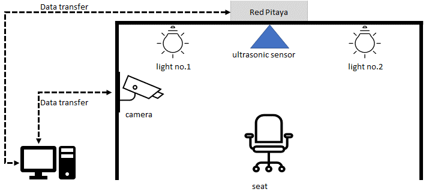

# Project Note on 2021.11.18 (Donnerstag)

Project title : Using Image Processing for Autonomous Illumination Sensor Optimization""

1. Project Lab Room is 8-20x (can't remember but it will be confirmed next time I go)
2. The goal of project is developing a system turn on/off between two lights with ultrasonic sensor to distinguish between when there is a person   and empty seat in an office.
3. There is a platform for experiment which is illustrated as following

4. The condition of the experiment platform is as following table

    |Scenario No.|Description|Light No.1 Status|Light No.2 Status|Remarks|
    |----------|--------------|----------|----------|----------|
    |1|Empty Seat|ON|OFF||
    |2|Person|OFF|ON||

5. Red Pitaya (RP) Control light no.1 and light no.2 with relay, computer control camera. Therefore, the synchronisation of time between two system must be done before taking the data.

6. According to 5. timestamp can be useful for both data from RP and camera.
